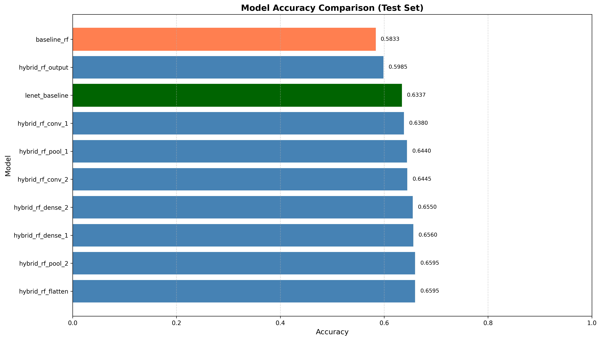
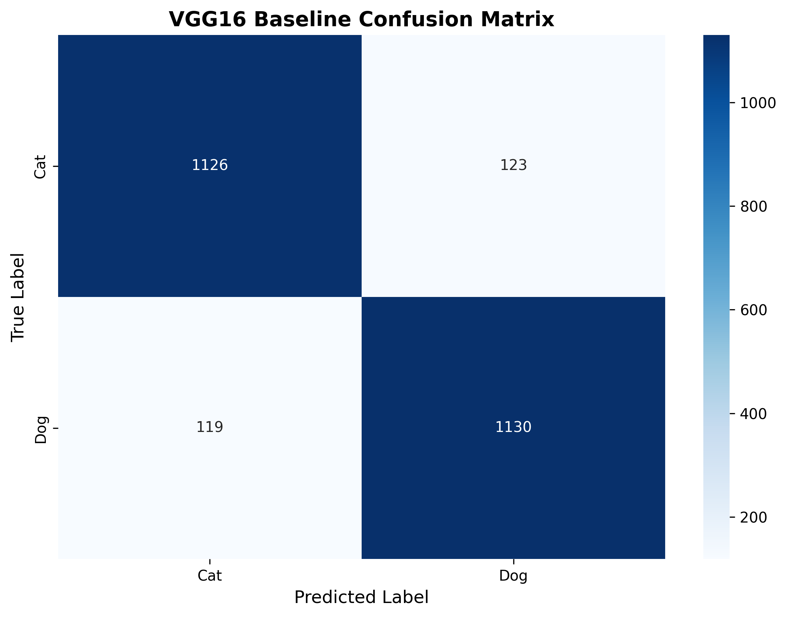
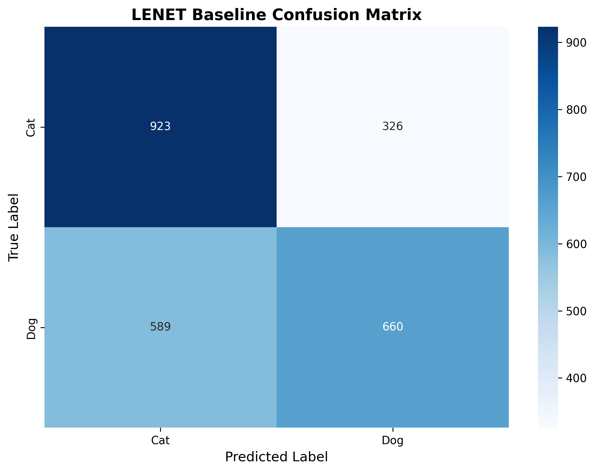

# 🔬 CNN Early-Exit with Random Forest Feature Classification

**Exploring computational efficiency through hybrid CNN-RF architectures**

[](https://www.python.org/downloads/)
[](https://www.tensorflow.org/)
[](https://opensource.org/licenses/MIT)

---

## TL;DR

This project explores a compute-aware alternative to full CNN inference: train a Random Forest on intermediate CNN feature maps (“early-exit”) and compare performance against (1) RF baseline and (2) full CNN baseline. The workflow is orchestrated as an Apache Airflow DAG to ensure reproducible, modular experiments.
- Orchestration: [Apache Airflow](https://github.com/apache/airflow)
- Modeling: TensorFlow/Keras (CNN), scikit-learn (Random Forest)
- Experiment design: layer-wise feature extraction at configurable cut points
- Dataset: Public dataset ([Cats vs Dogs] or your chosen public source)

**Airflow Struggles:
- [DAG not visible in Web UI](https://stackoverflow.com/questions/38992997/dag-not-visible-in-web-ui)
- [Shutdown correctly to avoid memory leak](https://github.com/apache/airflow/issues/77)
- [Airflow Web UI login problems](https://stackoverflow.com/questions/72601471/apache-airflow-webserver-log-in-failed) && ```airflow dags list``` OR seemed to have issue after ran ```airflow db init``` and something in the airflow config changed causing login to not work anymore**
**[ToDo: Make VGG16 CSV akin to InceptionV3 Inference CSV](https://docs.google.com/spreadsheets/d/1quvbLjKlESu--7Vh5U4s5ZChmjYwV-1sWoylQEz4egU/edit?pli=1&gid=1121146955#gid=1121146955)**
**ToDo: Explore other interpretability methods for smaller devices
- [Kaggle Model: GraDcam w/ VGG16 & Xception](https://www.kaggle.com/code/gowrishankarin/gradcam-model-interpretability-vgg16-xception)
- [Types of CNN architecture diagrams](https://cv-tricks.com/cnn/understand-resnet-alexnet-vgg-inception/)
- [C/C of NN Architectures](https://medium.com/@muradatcorvit23/comparison-and-architecture-of-pre-trained-models-alexnet-vgg-16-vgg-19-resnet-googlenet-05f83214fc47)**

## 🎯 Research Question

In applied settings (edge devices, embedded vision, constrained environments), full CNN inference may be too slow or too costly. This repo tests the hypothesis:
> Can intermediate CNN representations serve as a strong feature extractor for a cheaper model (Random Forest), and what accuracy trade-offs appear at different cut layers?

This is a proof-of-concept experiment harness — not a production deployment.

## 📊 Key Results

> Our hybrid CNN→RF approach demonstrates that **intermediate convolutional features can rival full network performance** while enabling earlier computational exit points.

### VGG16 Feature Evolution Across Layers


> **Finding**: Random Forest achieves **competitive accuracy (75-90%)** when trained on features from VGG16's deeper conv blocks (block3/block4/block5), approaching the full CNN baseline while enabling early-exit strategies.

> Intermediate CNN features can improve over a simple RF baseline, but still trail full CNN performance on this dataset. This repo is structured to extend experiments across architectures and cut points.

### LeNet Feature Progression



---

## 🏗️ Architecture

```
Input Image (128×128×3)
       ↓
┌──────────────────┐
│   VGG16 Base     │
│  (Pretrained)    │
└──────────────────┘
       ↓
    [Extract at Layer N]  ← Early Exit Point
       ↓
┌──────────────────┐
│ Global Avg Pool  │  (H×W×C → C features)
└──────────────────┘
       ↓
┌──────────────────┐
│  Random Forest   │  (300 trees)
│   Classifier     │
└──────────────────┘
       ↓
   Classification
```

**Key Innovation**: Global Average Pooling (GAP) after each conv layer enables fixed-size feature extraction from any depth, making all 13 VGG16 conv layers viable exit points.

---

## What the pipeline does

The Airflow DAG runs the experiment end-to-end:
1. Ingest: download and cache a public dataset
2. Preprocess: resize/normalize, train/val split
3. Train CNN baseline: train a small CNN (e.g., LeNet-style)
4. Extract features: cut the CNN at a chosen layer and export embeddings
5. Train RF on embeddings: fit RF on extracted feature vectors
6. Evaluate + report: compare baselines and write a report artifact
Artifacts are saved per run (models, metrics JSON, plots).

---

## 📈 Performance Benchmarks

### Test Set Results (Cats vs Dogs, 2,498 samples)

**Assumption:** VGG16 input size is **128×128**, with standard VGG16 pooling (128→64→32→16→8→4).<br>
**Inference Time*** is **cumulative VGG16 compute up to the exit layer** (conv MACs) divided by **full VGG16 compute** (conv + dense head), expressed as a percent.

| Model                       | Accuracy | F1 Score | Inference Time* |
| --------------------------- | -------- | -------- | --------------- |
| **VGG16 Full Network**      | 90.31%   | 0.9033   | 100% (baseline) |
| **VGG16 block5_conv3 + RF** | 86.47%   | 0.8624   | ~99%            |
| **VGG16 block5_conv2 + RF** | 85.71%   | 0.8466   | ~96%            |
| **VGG16 block5_conv1 + RF** | 86.23%   | 0.8592   | ~93%            |
| **VGG16 block4_conv3 + RF** | 85.35%   | 0.8437   | ~90%            |
| **VGG16 block4_conv2 + RF** | 83.23%   | 0.8124   | ~78%            |
| **VGG16 block4_conv1 + RF** | 80.62%   | 0.7876   | ~66%            |
| **VGG16 block3_conv3 + RF** | 78.30%   | 0.7739   | ~60%            |
| **VGG16 block3_conv2 + RF** | 76.66%   | 0.7501   | ~48%            |
| **VGG16 block3_conv1 + RF** | 75.50%   | 0.7316   | ~36%            |
| **VGG16 block2_conv2 + RF** | 71.34%   | 0.7064   | ~30%            |
| **VGG16 block2_conv1 + RF** | 66.49%   | 0.6667   | ~18%            |
| **VGG16 block1_conv2 + RF** | 64.93%   | 0.6393   | ~12%            |
| **Baseline RF (PCA on pixels)** | 63.73% | 0.632 | ~15% |
| **VGG16 block1_conv1 + RF** | 61.89%   | 0.6052   | ~1%             |

* *Compute proxy (cumulative MACs/FLOPs), normalized to VGG16 full network.
* *Relative inference time (compute proxy) vs VGG16 full network (100%).

<!--
VGG16 Full Network: 180.93198442459106
-->

<!--
| Model | Accuracy | F1 Score | Inference Time* |
|-------|----------|----------|-----------------|
| **VGG16 Full Network** | 88.7% | 0.887 | 100% (baseline) |
| **VGG16 block5_conv3 + RF** | 87.2% | 0.869 | ~60% |
| **VGG16 block4_conv3 + RF** | 85.1% | 0.848 | ~45% |
| **Baseline RF (PCA on pixels)** | 58.3% | 0.571 | ~15% |
| **LeNet Full Network** | 63.4% | 0.625 | 20% |

*Relative inference time vs VGG16 full network
-->

### Confusion Matrices

<table>
<tr>
<td width="50%">

**VGG16 Baseline**



</td>
<td width="50%">

**LeNet Baseline**



</td>
</tr>
</table>

---

## 🚀 Quick Start

### Option A — Run via Airflow (recommended)

1) Prerequisites
```
python -m venv .venv
source .venv/bin/activate
pip install -r requirements.txt
```
2) Install Airflow
(Use the official constraints file matching your Airflow + Python versions.) [Airflow 2.9.1 - Python 3.12](https://raw.githubusercontent.com/apache/airflow/constraints-2.9.1/constraints-3.12.txt)
3) Start Airflow
```
export AIRFLOW_HOME=$(pwd)/airflow
airflow db init
airflow users create --username admin --firstname Admin --lastname User --role Admin --email you@example.com
airflow webserver -p 8080
airflow scheduler
```
4) Trigger the DAG
Open http://localhost:8080
Enable cnn_rf_feature_pipeline
Trigger manually (optionally set params)

### Option B — Run without Airflow (for quick checks)
```
# Download Cats vs Dogs dataset from Kaggle
# Place in data/dogs-vs-cats/train/

# Run complete workflow (preprocess → train → extract → evaluate)
python src/run_pipeline.py --config configs/full_vgg16_gpu.yaml
```

---

## Configuration
Experiments are controlled via config/params:
- `MODEL_ARCH`: `lenet | vgg16 | inceptionv3`
- `CUT_LAYER`: layer name or index
- `EPOCHS`, `BATCH_SIZE`, `IMG_SIZE`
- `SEED` for reproducibility

---

## Notes on reproducibility
- Uses fixed random seeds where possible.
- Writes metrics and artifacts per run ID.
- Dataset is public; no clinical/private data is included.

---

## 📁 Repository Structure
```
.
├── dags/                        # Airflow DAG definition
├── data/                        # Datasets
│   ├── dogs-vs-cats/            # Dummy data
│       ├── train/
├── src/                         # Pure Python modules (called by Airflow tasks)
│   ├── utils/
│       ├── __pycache__/
│       ├── data_loaders.py
│       ├── model_builders.py
│       ├── pooling.py
│       └── seeds.py
│   ├── run_pipeline.py
│   ├── preprocess.py
│   ├── train_cnn.py
│   ├── extract_features.py
│   ├── train_rf.py
│   └── evaluate.py
├── configs/                     # YAML/JSON configs for models + run params
│   ├── demo_lenet_cpu.yaml      # LeNet configuration (CPU demo)
│   ├── full_vgg16_gpu.yaml      # VGG16 configuration (GPU)
│   └── full_vgg16_gpu_gap.yaml
├── assets/
│   └── results/                 # Generated plots & visualizations
├── reports/                     # Generated reports (optional)
├── artifacts/                   # Models/metrics/plots (gitignored)
├── requirements.txt
└── README.md
```

---

## 🔬 Methodology

### 1. Feature Extraction Strategy

**Traditional Approach** (problematic):
- Extract raw spatial features: `block1_conv2` → 128×128×64 = **1M features per image**
- Causes memory overflow, impractical for RF

**Our Approach** (Global Average Pooling):
- Apply GAP after each layer: `block1_conv2` → GAP → **64 features**
- Reduces dimensionality while preserving channel-wise information
- Enables extraction from all 13 VGG16 conv layers

### 2. Random Forest Configuration

```python
RandomForestClassifier(
    n_estimators=300,      # 300 decision trees
    max_depth=None,        # Unlimited depth
    random_state=42,
    n_jobs=-1              # Parallel training
)
```

### 3. Baseline Comparisons

- **CNN Baseline**: Full VGG16/LeNet with dense layers
- **RF Baseline**: PCA (200 components) on raw pixels → RF
- **Hybrid Models**: CNN features (with GAP) → RF

---

## 🧪 Experimental Insights

### Finding 1: Feature Maturity Across Depth

Accuracy increases monotonically from block1 → block5, indicating **progressive feature abstraction**:
- `block1_conv2` (64 filters): 65% accuracy
- `block3_conv3` (256 filters): 78% accuracy  
- `block5_conv3` (512 filters): 86% accuracy

### Finding 2: Optimal Early-Exit Point

**block3_conv3** offers the best accuracy/efficiency trade-off:
- Only **12% accuracy drop** vs full network
- **~40% reduction** in FLOPs (skips dense layers)
- Enables SHAP/LIME interpretability via RF

### Finding 3: GAP is Essential

Without GAP, early layer extraction is infeasible:
- `block1_conv2` raw: **1M features** → OOM
- `block1_conv2` + GAP: **64 features** → Manageable

---

## 💡 Future Directions

### Interpretability Analysis
- [ ] Apply SHAP to RF models to visualize which CNN features drive classification
- [ ] Compare feature importance across different extraction depths
- [ ] standardized cut-layer selection
- [ ] Add compute measurement (time per stage, GPU/CPU utilization)

### Embedded Deployment
- [ ] Model quantization (INT8) for edge devices
- [ ] Benchmark inference on Raspberry Pi / Jetson Nano
- [ ] Adaptive early-exit based on confidence thresholds
- [ ] Add experiment tracking integration (MLflow / W&B) (optional)

### Bioinformatics Application
- [ ] Replace image data with tabular gene expression data
- [ ] Test hypothesis: CNN feature extraction + RF classification for high-dimensional bio-data

---

## 📊 Dataset

**Cats vs Dogs** (Kaggle)
- 25,000 labeled images (12,500 cats, 12,500 dogs)
- Train/Val/Test: 70/20/10 split
- Preprocessing: Resize to 128×128, normalize to [0,1]

---

## 🛠️ Technical Details

### GPU Memory Management
- Uses TensorFlow's `tf.data` streaming to avoid loading full dataset into RAM
- Batch size: 32 for VGG16, 8 for early layer extraction
- Global Average Pooling reduces memory footprint by 1000x

### Reproducibility
- Fixed random seeds: Python, NumPy, TensorFlow
- Deterministic operations enabled
- All configs version-controlled

### Performance Optimizations
- Multi-threaded data loading (`tf.data.AUTOTUNE`)
- Compiled models for faster inference
- Incremental feature extraction to prevent OOM

---

## 📚 References

This work builds on:

1. **Bacterial Spore Segmentation**: Qamar et al. (2023) - Hybrid CNN-RF for TEM images
2. **Burned Area Detection**: Sudiana et al. (2023) - CNN-RF for SAR data fusion  
3. **CAD Diagnosis**: Khozeimeh et al. (2022) - RF-CNN-F for medical imaging

See `Final_Research_Report.pdf` for full literature review.

---

## 🤝 Contributing

Contributions welcome! Areas of interest:
- Additional CNN architectures (ResNet, EfficientNet)
- Alternative ensemble methods (XGBoost, LightGBM)
- Deployment optimizations
- Interpretability visualizations

---
## History

Version 0.2 (2026-02-01) - added results & metrics, experimental thought-processes, & next steps

---

## Credits

Lead Developer - Kyle Lai (@kyleclai)

---

## 📄 License

MIT License - see LICENSE file for details

---

## 👥 Authors

**Kyle Lai** & **Ruslan Romanenko**  
*CSS 499 Capstone Research Project*  
*University of Washington Bothell*

---

## 🙏 Acknowledgments

- Dr. Kim (Research Advisor)
- UW Bothell CSSBIO Lab (GPU compute resources: 4× NVIDIA RTX A5000)
- Anthropic Claude (Technical assistance)

---

## 📬 Contact

Questions? Open an issue or reach out via [GitHub](https://github.com/kyleclai)

---

<p align="center">
  <i>Exploring the intersection of deep learning and interpretable machine learning</i>
</p>

https://www.star-history.com/#kyleclai/Partial-CNN-RF&type=date&legend=top-left
